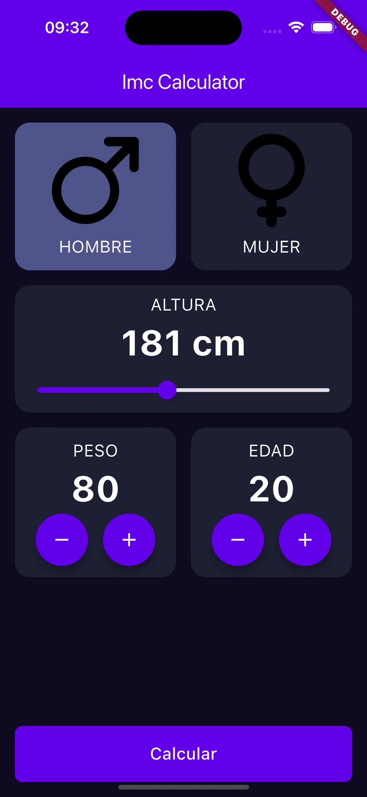
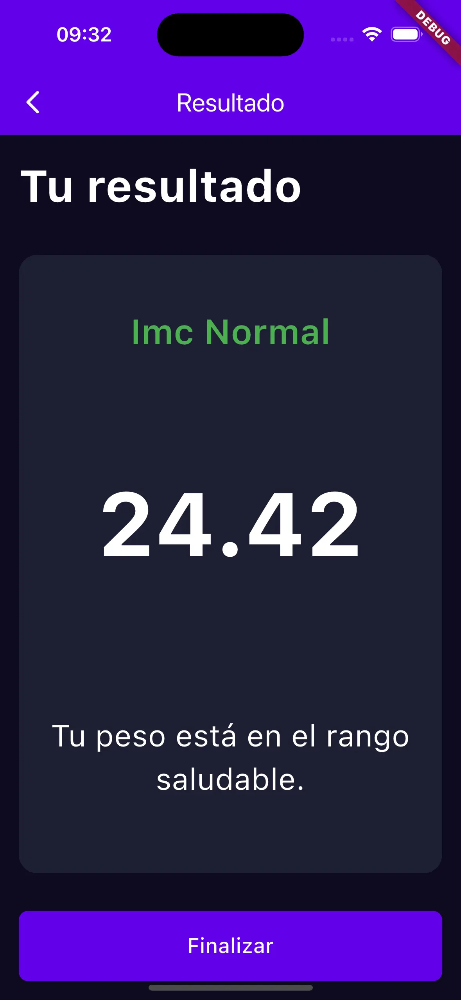
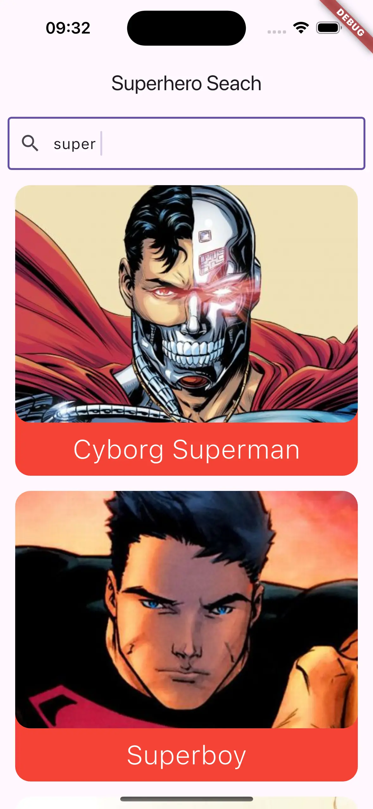
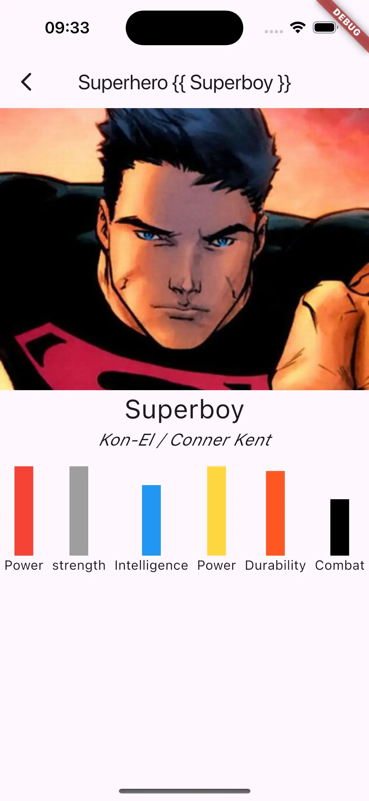
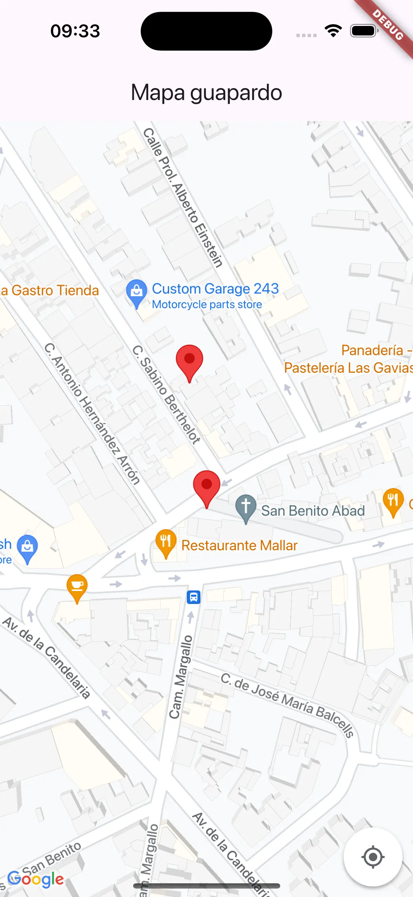
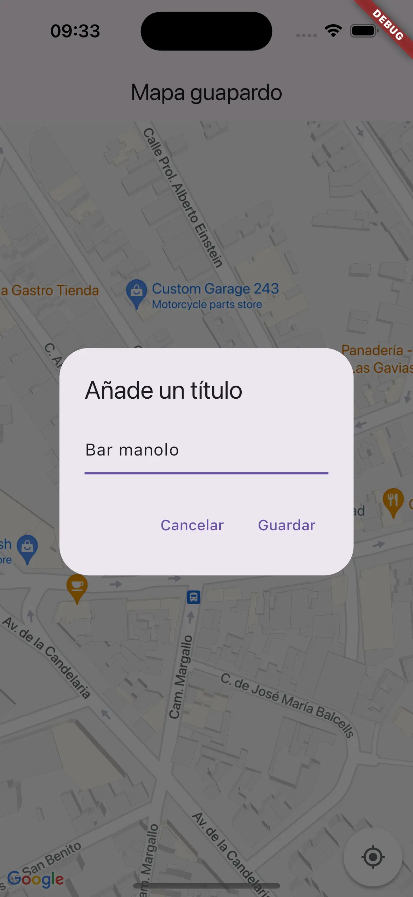
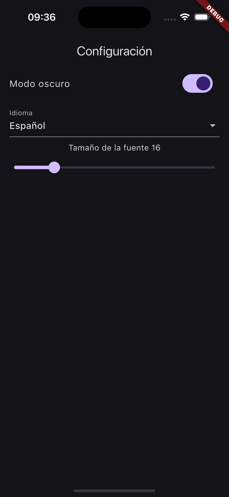

# Flutter-Expert - Curso Dart y Flutter desde CERO.

<a href="https://youtu.be/IKG1eV2SetA">
</a>

 
    
    
    

----------

## Aprende a PROGRAMAR aplicaciones en para ANDROID y iOS con Flutter

Temario:
 

- [Introducción y presentación del curso](https://youtu.be/IKG1eV2SetA?t=0)
- [Configuración del entorno](https://youtu.be/IKG1eV2SetA?t=134)
  - [Mac](https://youtu.be/IKG1eV2SetA?t=172)
  - [Windows](https://youtu.be/IKG1eV2SetA?t=1935)
- [Aprendiendo Dart](https://youtu.be/IKG1eV2SetA?t=2726)
  - [Variables](https://youtu.be/IKG1eV2SetA?t=3020)
  - [Operaciones con variables](https://youtu.be/IKG1eV2SetA?t=4368)
  - [Ejercicios #1](https://youtu.be/IKG1eV2SetA?t=5053)
  - [Entrada de datos](https://youtu.be/IKG1eV2SetA?t=4401)
  - [Estructuras condicionales](https://youtu.be/IKG1eV2SetA?t=5893)
  - [Ejercicios #2](https://youtu.be/IKG1eV2SetA?t=6905)
  - [Funciones](https://youtu.be/IKG1eV2SetA?t=7220)
  - [Listas](https://youtu.be/IKG1eV2SetA?t=8140)
  - [Set](https://youtu.be/IKG1eV2SetA?t=8758)
  - [Map](https://youtu.be/IKG1eV2SetA?t=9111)
  - [Bucles](https://youtu.be/IKG1eV2SetA?t=9469)
  - [Ejercicios #3](https://youtu.be/IKG1eV2SetA?t=10239)
  - [Clases y POO](https://youtu.be/IKG1eV2SetA?t=10917)
  - [Nulabilidad](https://youtu.be/IKG1eV2SetA?t=11529)
- [Introducción a Flutter](https://youtu.be/IKG1eV2SetA?t=12000)
  - [Entorno](https://youtu.be/IKG1eV2SetA?t=12036)
  - [Column](https://youtu.be/IKG1eV2SetA?t=12672)
  - [Row](https://youtu.be/IKG1eV2SetA?t=13534)
  - [Spacer](https://youtu.be/IKG1eV2SetA?t=14118)
  - [Text](https://youtu.be/IKG1eV2SetA?t=14353)
  - [TextField](https://youtu.be/IKG1eV2SetA?t=14865)
  - [Button](https://youtu.be/IKG1eV2SetA?t=15455)
  - [Image](https://youtu.be/IKG1eV2SetA?t=16062)
  - [Scaffold](https://youtu.be/IKG1eV2SetA?t=16218)
  - [AppBar](https://youtu.be/IKG1eV2SetA?t=16397)
- [Imc App](https://youtu.be/IKG1eV2SetA?t=16717)
  - [Colores y estilos](https://youtu.be/IKG1eV2SetA?t=17016)
  - [StateFull Widgets](https://youtu.be/IKG1eV2SetA?t=17462)
  - [Slider](https://youtu.be/IKG1eV2SetA?t=19436)
  - [NumberSelector](https://youtu.be/IKG1eV2SetA?t=20052)
  - [Personalizando botones](https://youtu.be/IKG1eV2SetA?t=21140)
  - [Devolviendo parámetros y funciones](https://youtu.be/IKG1eV2SetA?t=21644)
  - [Navegación](https://youtu.be/IKG1eV2SetA?t=22302)
  - [Diseñando el detalle](https://youtu.be/IKG1eV2SetA?t=23240)
  - [Lógica](https://youtu.be/IKG1eV2SetA?t=24135)
- [Superhero App](https://youtu.be/IKG1eV2SetA?t=25380)
  - [Creando el buscador](https://youtu.be/IKG1eV2SetA?t=25620)
  - [Entiendo las APIs](https://youtu.be/IKG1eV2SetA?t=25833)
  - [Consumiendo APIs](https://youtu.be/IKG1eV2SetA?t=26369)
  - [Mejorando los items](https://youtu.be/IKG1eV2SetA?t=27325)
  - [Diseñando el detalle](https://youtu.be/IKG1eV2SetA?t=28770)
- [Map App](https://youtu.be/IKG1eV2SetA?t=28874)
  - [Configurando Google Maps](https://youtu.be/IKG1eV2SetA?t=29021)
  - [Arreglando fallos de Android](https://youtu.be/IKG1eV2SetA?t=29815)
  - [Arreglando fallos de iOS](https://youtu.be/IKG1eV2SetA?t=29976)
  - [Markers](https://youtu.be/IKG1eV2SetA?t=30476)
  - [Creando markers desde el dialog](https://youtu.be/IKG1eV2SetA?t=30609)
- [Settings App](https://youtu.be/IKG1eV2SetA?t=31074)
  - [Switch](https://youtu.be/IKG1eV2SetA?t=31247)
  - [DropDown](https://youtu.be/IKG1eV2SetA?t=31404)
  - [Slider](https://youtu.be/IKG1eV2SetA?t=31620)
  - [Persistencia de datos](https://youtu.be/IKG1eV2SetA?t=31729)
  - [Modo oscuro](https://youtu.be/IKG1eV2SetA?t=32427)
- [Despedida :(](https://youtu.be/IKG1eV2SetA?t=32626)

----------

## Aplicaciones desarrolladas durante el curso.

### Calculador IMC.

|                               Pantalla principal                               |                                   Resultado                                    |
|:------------------------------------------------------------------------------:|:------------------------------------------------------------------------------:|
|    |    |

### Buscador de superhéroes.

|                              Pantalla principal                              |                               Añadiendo tareas                               |
|:----------------------------------------------------------------------------:|:----------------------------------------------------------------------------:|
|  |  |

### Mapas y markers.

|                              Pantalla principal                              |                               Añadiendo tareas                               |
|:----------------------------------------------------------------------------:|:----------------------------------------------------------------------------:|
|  |  |

### Pantalla de ajustes.

|                              Pantalla principal                              |                               Añadiendo tareas                               |
|:----------------------------------------------------------------------------:|:----------------------------------------------------------------------------:|
|  |  |

----------

## 👨‍💻 Autor

Desarrollado por **[AristiDevs](https://aristi.dev)**.

- [YouTube](https://www.youtube.com/@ArisGuimera)
- [Twitter](https://twitter.com/ArisGuimera)
- [LinkedIn](https://www.linkedin.com/in/arisguimera/)

----------

## 🚀 AppCademy.dev

<a href="https://appcademy.dev">
</a>

Este curso está patrocinado por [AppCademy.dev](https://appcademy.dev) mi plataforma de cursos premium donde no solo aprendemos tecnologías sino que profundizamos en sus desarrollos a través de buenas prácticas y contenido avanzado.

----------

## 📦 Otros Proyectos

Si te gustó este proyecto, no olvides echar un vistazo a otros repositorios:

<table>
<tr>
<td width="50%">
<h3 align="center">Curso Android Básico</h3>

Aprende a programar aplicaciones <strong>Android con Kotlin desde cero</strong> - En este curso aprenderás todo lo necesario ya que no es necesario ningún conocimiento previo. Curso <strong>GRATUITO de 12 horas</strong> con todo el código disponible para descargar.

</td>

<td width="50%">
                
<h3 align="center">Arquitectura MVVM</h3>

 

Las arquitecturas son <strong>IMPRESCINDIBLES</strong> para poder trabajar como desarrollador/a Android. En este curso, divido por ramas irás aprendiendo a implementar una arquitectura real y robusta con inyección de dependencias, clean architecture, testing y mucho más.

</table>

 

<table>
<tr>
<td width="50%">
<h3 align="center">Curso Android Intermedio</h3>

Aprende a programar aplicaciones <strong>Android con Kotlin nivel intermedio</strong> - En este curso nos centraremos en las <strong>buenas prácticas, arquitectura y testing</strong>. Curso <strong>GRATUITO de 8 horas</strong> con todo el código disponible para descargar.

</td>

<td width="50%">
<h3 align="center">Curso Kotlin Multiplatform</h3>

Aprende a programar aplicaciones <strong>multiplataform con Kotlin y Jetpack Compose</strong> - En este curso nos centraremos en dominar Kotlin Multiplatform <strong>desde cero</strong>. Curso <strong>GRATUITO</strong> (en desarrollo) con todo el código disponible para descargar.

</td>  
</table>

 
